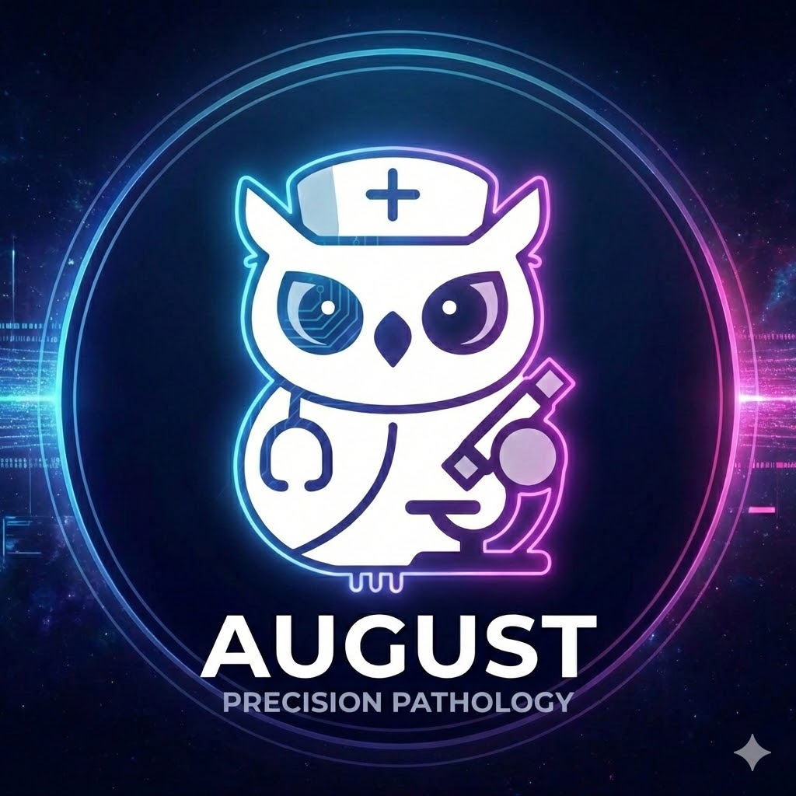
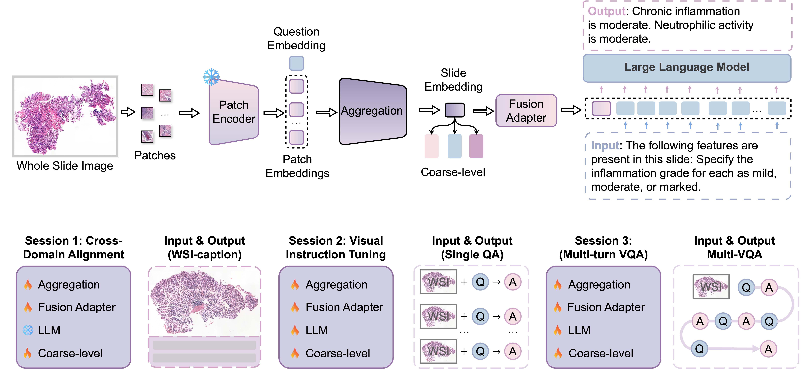

# AUGUST


## Sequential question–answering AI for hierarchical gastric pathology diagnosis

[Download Model](https://huggingface.co/khangnq/AUGUST) | [GastUJB](https://github.com/QuIIL/GastUJB) |


**Abstract:** Artificial intelligence in digital pathology has evolved from task-specific models to multimodal foundation models. However, clinical adoption remains limited by a misalignment between model design and the hierarchical, conditional nature of diagnostic reasoning. In complex domains, such as gastric pathology, diagnosis requires navigating strictly dependent steps where downstream tasks are only clinically valid given specific upstream findings. Regardless, current computational approaches often treat diagnostic tasks in isolation, obscuring these critical dependencies. Herein, we present **AUGUST** (Adaptive Unified Gastric diagnosis Using Sequential Tasks), a sequential question-answering framework designed to mimic the stepwise reasoning of pathologists. **AUGUST** explicitly models diagnostic dependencies by iteratively generating task-specific questions conditioned on prior findings, projecting whole slide images into context-aware representations, and producing answers constrained to clinically valid pathways. We evaluated **AUGUST** on 23,072 gastric whole slide images spanning 19 hierarchical tasks and 79,924 question–answer pairs. In both fully autonomous and human-in-the-loop settings, AUGUST outperformed state-of-the-art multiple instance learning, pathology-specific vision-language, and foundation models on a wide range of datasets and tasks. Our results demonstrate that AUGUST has superior hierarchical consistency and diagnostic accuracy across coarse-, fine-, and grading-levels.


## What is AUGUST? 
**AUGUST** (**A**daptive **U**nified **G**astric diagnosis **U**sing **S**equential **T**asks) is a sequential question-answering framework designed to mimic the stepwise reasoning of pathologists. It leverages 6,913 whole-slide images (WSIs) from a diverse set of internally collected gastric cases at Catholic University of Korea Uijeongbu St. Mary’s Hospital (2014–2023). Additionally, **AUGUST** explicitly models diagnostic dependencies by iteratively generating task-specific questions conditioned on prior findings, projecting whole slide images into context-aware representations, and producing answers constrained to clinically valid pathways. AUGUST's achieve state-of-the-art performance on a range of datasets and tasks.
- _**Why use AUGUST?**_: Compared to other vision-language, foundation models and multiple instance learning (MIL) that rely on either one of vision-only pretraining or vision-language alignment, AUGUST combined question embbeding and hierarchical workflow into its inner workflow to ensure the gastric cancer diagnosis
- _**Three-sesssion pre-training: (1) Cross-domain alignment, using $6,913$ WSI-caption (a list of all associated labels) pairs to ground visual features in diagnostic concepts; (2) Visual instruction tuning, using the 27,069 question-answer pairs with $6,913$ WSIs to acquire task-specific diagnostic behaviors; and (3) Multi-turn VQA, which restructured the same WSIs and question-answer pairs into chain-of-thought (CoT) sequences, enabling the model to conduct hierarchical, conditional, and context-aware reasoning across progressive diagnostic steps.





## Updates
- **16/01/2026**: Official Code for AUGUST is released.
- **14/01/2026**: Dataset [GastUJB](https://github.com/QuIIL/GastUJB) are now live.

## Installation

First clone the repo and cd into the directory:

```bash
git clone https://github.com/QuIIL/AUGUST.git
cd AUGUST
```

Then create a conda env and install the dependencies:

```bash
conda create -n august python=3.10 -y
conda activate august
pip install --upgrade pip
pip install -r requirements.txt .
```

### 1. Getting access

Request access to the model weights from the Huggingface model page [here](https://huggingface.co/khangnq/AUGUST).

### 2. Load model
Following `./notebooks`, AUGUST is loaded by model weights provied by Huggingface. It includes the functionalities to extract slide embeddings from patch embeddings and to perform diagnosis. More details can be found in our demo notebooks.

```python
from august.models.august import AUGUST

model = AUGUST(pretrain="checkpoint_path") # ['stage_1', 'stage_2','stage_3']
```
### 3. Dataset Prepraping
Following `./dataset_prepraing` modules, you can construc `json` format for all training session based on `csv` metadata file (Ex: `./august/data/sample.csv`). `Json` file includes all samples with `features`, `caption` and `conversations`:

```json
    {
        "train::1": {
        "features_path": "feature_path",
        "caption": "helicobacter pylori: negative\ncondition: cancer, carcinoma, adenocarcinoma, poorly cohesive carcinoma",
        "conversations": [
            {
                "question": "Is this slide positive or negative for Helicobacter pylori infection?\nPlease format your answer as: 'This slide is {positive/negative} for Helicobacter pylori infection.'.",
                "answer": "This slide is negative for Helicobacter pylori infection.",
                "label": [
                    "negative"
                ],
                "task": [
                    "negative",
                    "positive"
                ]
            },
            {
                "question": "Considering the spectrum of gastric pathology, determine the category of diagnosis represented in this slide: inflammatory disease, benign tumor, dysplasia, or cancer.\nPlease format your answer as: 'The category of diagnosis represented in this slide is {inflammatory disease/benign tumor/dysplasia/cancer}.'.",
                "answer": "The category of diagnosis represented in this slide is cancer.",
                "label": [
                    "cancer"
                ],
                "task": [
                    "inflammatory disease",
                    "benign tumor",
                    "dysplasia",
                    "cancer"
                ]
            },
            {
                "question": "This slide shows malignant features. Determine the type of malignant tumor: carcinoma, malignant lymphoma, or NOS. If it is a carcinoma, also identify the histologic subtype.\nPlease format your answer as:\n* For malignant lymphoma or NOS: 'The malignant tumor is a {malignant lymphoma/NOS}.'\n* For carcinoma: 'The malignant tumor is a carcinoma, {adenocarcinoma/squamous cell carcinoma/neuroendocrine tumor}.'.",
                "answer": "The malignant tumor is a carcinoma, adenocarcinoma.",
                "label": [
                    "carcinoma, adenocarcinoma"
                ],
                "task": [
                    "malignant lymphoma",
                    "carcinoma, adenocarcinoma",
                    "carcinoma, squamous cell carcinoma",
                    "carcinoma, neuroendocrine tumor",
                    "nos"
                ]
            },
            {
                "question": "Given the malignant tumor type carcinoma, adenocarcinoma, specify the relevant detail or additional condition.\nPlease format your answer as: 'For adenocarcinoma, the tumor is {well differentiated/moderately differentiated/poorly cohesive carcinoma}.",
                "answer": "For carcinoma, adenocarcinoma, the tumor is poorly cohesive carcinoma.",
                "label": [
                    "poorly cohesive carcinoma"
                ],
                "task": [
                    "well differentiated",
                    "moderately differentiated",
                    "poorly cohesive carcinoma"
                ]
            }
        ]
        }
    }
```
### 4. Training AUGUST
Following `./scripts` folder, for training AUGUST with three sessions. All data for 3 training sessions is provided with `json` file and configs in `./configs/configs.yaml`

### 5. Inference

You can directly use AUGUST for both single-QA and multi-turn QA. AUGUST builds a slide embbeding from a squence of patch embeddings and a question embedding by MIL. Patch setting is 512 x 512 px at magnification is 20x. 

```python
device = torch.device("cuda" if torch.cuda.is_available() else "cpu")
model = model.to(device)

conversation = {
    "features_path": "/feature_paths",
        "caption": "location: proximal stomach, body\ncondition: benign tumor, fundic gland polyp",
        "conversation": [
            {
                "question": "Considering the spectrum of gastric pathology, determine the category of diagnosis represented in this slide: inflammatory disease, benign tumor, dysplasia, or cancer.\nPlease format your answer as: 'The category of diagnosis represented in this slide is {inflammatory disease/benign tumor/dysplasia/cancer}.'.",
            }
        ]
}
question = conversation["conversation"][0]
features = h5py.File(conversation["features_path"])

with torch.auto('cude', torch.bfloat16), torch.inference_mode():
    features = h5py.File(conversation["features_path"]).to(device)
    slide_embbeding, question_embedding = model.get_slide_embedding(features, question)
    answer = model(slide_embbeding,question,question_embedding)
```

## Demo for specific use cases

We provide a set of demo notebooks to showcase the capabilities of AUGUST. The notebooks include:
- **HITL-QA** on a single slide  in `notebooks/hitl-qa.ipynb`.
- **Auto-QA** evaluation on a single slide dataset in `notebooks/auto-qa.ipynb`.

### Dataset descriptions
- **GastUJB** is a WSIs dataset  was curated from Korea Uijeongbu St. Mary’s Hospital. The dataset can now be accessed [here](https://github.com/QuIIL/GastUJB).


